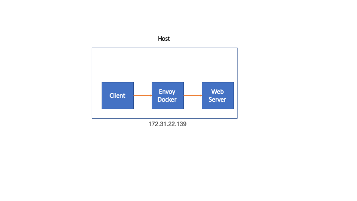

# Tutorial

**Tested on Ubuntu 18.04**

In this example we will demonstrate how to add custom HTTP headers to a request. For that we run a Envoy Proxy on that listens on port 4999 and directs to a local server running on port 5000.
 
 We will use simple-go-server for this example since we want to show the HTTP headers received. 
 
## 1. Network Diagram

The HTTP Client (cURL), Envoy proxy and Web Server share the same host. cURL and Web Server run as a native applications while Envoy runs in a docker container



## 2 Custom Headers

We will (theoretically) add and append two different headers. Customer header documentation is [here](https://www.envoyproxy.io/docs/envoy/v1.11.1/configuration/http_conn_man/headers#custom-request-response-headers):

First under route config

```
      request_headers_to_add:
        - header:
            key: "x-request-upstream"
            value: "%UPSTREAM_REMOTE_ADDRESS%"
          append: true
        - header:
            key: "x-request-downstream-combo"
            value: "%START_TIME(%Y/%m/%dT%H:%M:%S%z %s)%"
          append: true
```

Then append at virtual host level.

```
        - header:
            key: "x-request-upstream"
            value: "%UPSTREAM_REMOTE_ADDRESS%"
          append: true
        - header:
            key: "x-request-downstream-combo"
            value: "%DOWNSTREAM_LOCAL_ADDRESS%"
          append: true
``` 


## 3. Envoy Docker

Build and run the envoy container. The container runs with *--network host* in order to reach the web server running on the host.

```
./build_envoy_docker.sh
``` 


## 4. Web Server

In this example we used the simple-go-server because we want to show the HTTP headers received. 

Go to *simple-go-server* directory:

```
go build
./simple-go-server
```

## 5. HTTP Request

Now with the Web Server running issue the request. It will be processed by the Envoy Proxy container and directed to the web Server

```
ubuntu$ curl -v localhost:4999
* Rebuilt URL to: localhost:4999/
*   Trying 127.0.0.1...
* TCP_NODELAY set
* Connected to localhost (127.0.0.1) port 4999 (#0)
> GET / HTTP/1.1
> Host: localhost:4999
> User-Agent: curl/7.58.0
> Accept: */*
>
< HTTP/1.1 200 OK
< content-type: text/plain; charset=utf-8
< x-content-type-options: nosniff
< x-request-id: c04dd4d1-96c5-4a14-bf33-331f4747fff5
< date: Tue, 03 Sep 2019 17:56:12 GMT
< content-length: 14
< x-envoy-upstream-service-time: 0
< server: envoy
<
Hello, World!
* Connection #0 to host localhost left intact
```

## 6. Web Server Logs

These are the headers received by the web server. Notice the headers we added. You might have noticed that X-Request-Upstream is missing. Unfortunately I do not know why and opened a [bug](https://github.com/envoyproxy/envoy/issues/8127) for it. 

```
$ ./simple-go-server
http: 2019/09/03 17:41:39 Simple go server
http: 2019/09/03 17:41:39 Version:
http: 2019/09/03 17:41:39 GitTag:
http: 2019/09/03 17:41:39 GitCommit:
http: 2019/09/03 17:41:39 GitTreeState:
http: 2019/09/03 17:41:39 Server is starting...
http: 2019/09/03 17:41:39 Server is ready to handle requests at :5000

HTTP Headers Received:
======================
User-Agent                              : curl/7.58.0
X-Forwarded-Proto                       : http
X-Request-Downstream-Combo              : 127.0.0.1:4999
X-Request-Downstream-Combo              : 2019/09/03T17:56:12+0000 1567533372
Content-Length                          : 0
Accept                                  : */*
X-Request-Id                            : c04dd4d1-96c5-4a14-bf33-331f4747fff5
X-Envoy-Expected-Rq-Timeout-Ms          : 15000

http: 2019/09/03 17:56:12 c04dd4d1-96c5-4a14-bf33-331f4747fff5 GET / [::1]:58086 curl/7.58.0

```

## 7. Envoy Logs

Envoy Logs from a successful run.

```
[2019-09-03 17:56:12.841][14][debug][filter] [source/extensions/filters/listener/original_dst/original_dst.cc:18] original_dst: New connection accepted
[2019-09-03 17:56:12.841][14][debug][main] [source/server/connection_handler_impl.cc:280] [C0] new connection
[2019-09-03 17:56:12.841][14][debug][http] [source/common/http/conn_manager_impl.cc:246] [C0] new stream
[2019-09-03 17:56:12.843][14][debug][http] [source/common/http/conn_manager_impl.cc:619] [C0][S3249875550616223791] request headers complete (end_stream=true):
':authority', 'localhost:4999'
':path', '/'
':method', 'GET'
'user-agent', 'curl/7.58.0'
'accept', '*/*'

[2019-09-03 17:56:12.843][14][debug][http] [source/common/http/conn_manager_impl.cc:1111] [C0][S3249875550616223791] request end stream
[2019-09-03 17:56:12.843][14][debug][router] [source/common/router/router.cc:401] [C0][S3249875550616223791] cluster 'cluster1' match for URL '/'
[2019-09-03 17:56:12.843][14][debug][router] [source/common/router/router.cc:514] [C0][S3249875550616223791] router decoding headers:
':authority', 'localhost:4999'
':path', '/'
':method', 'GET'
':scheme', 'http'
'user-agent', 'curl/7.58.0'
'accept', '*/*'
'x-forwarded-proto', 'http'
'x-request-id', 'c04dd4d1-96c5-4a14-bf33-331f4747fff5'
'x-envoy-expected-rq-timeout-ms', '15000'
'x-request-downstream-combo', '127.0.0.1:4999'
'x-request-downstream-combo', '2019/09/03T17:56:12+0000 1567533372'

[2019-09-03 17:56:12.843][14][debug][pool] [source/common/http/http1/conn_pool.cc:88] creating a new connection
[2019-09-03 17:56:12.843][14][debug][client] [source/common/http/codec_client.cc:26] [C1] connecting
[2019-09-03 17:56:12.843][14][debug][connection] [source/common/network/connection_impl.cc:704] [C1] connecting to [::1]:5000
[2019-09-03 17:56:12.843][14][debug][connection] [source/common/network/connection_impl.cc:713] [C1] connection in progress
[2019-09-03 17:56:12.843][14][debug][pool] [source/common/http/conn_pool_base.cc:20] queueing request due to no available connections
[2019-09-03 17:56:12.843][14][debug][connection] [source/common/network/connection_impl.cc:552] [C1] connected
[2019-09-03 17:56:12.843][14][debug][client] [source/common/http/codec_client.cc:64] [C1] connected
[2019-09-03 17:56:12.843][14][debug][pool] [source/common/http/http1/conn_pool.cc:241] [C1] attaching to next request
[2019-09-03 17:56:12.843][14][debug][router] [source/common/router/router.cc:1503] [C0][S3249875550616223791] pool ready
[2019-09-03 17:56:12.844][14][debug][router] [source/common/router/router.cc:994] [C0][S3249875550616223791] upstream headers complete: end_stream=false
[2019-09-03 17:56:12.844][14][debug][http] [source/common/http/conn_manager_impl.cc:1378] [C0][S3249875550616223791] encoding headers via codec (end_stream=false):
':status', '200'
'content-type', 'text/plain; charset=utf-8'
'x-content-type-options', 'nosniff'
'x-request-id', 'c04dd4d1-96c5-4a14-bf33-331f4747fff5'
'date', 'Tue, 03 Sep 2019 17:56:12 GMT'
'content-length', '14'
'x-envoy-upstream-service-time', '0'
'server', 'envoy'

[2019-09-03 17:56:12.845][14][debug][client] [source/common/http/codec_client.cc:95] [C1] response complete
[2019-09-03 17:56:12.845][14][debug][pool] [source/common/http/http1/conn_pool.cc:198] [C1] response complete
[2019-09-03 17:56:12.845][14][debug][pool] [source/common/http/http1/conn_pool.cc:236] [C1] moving to ready
[2019-09-03 17:56:12.846][14][debug][connection] [source/common/network/connection_impl.cc:520] [C0] remote close
[2019-09-03 17:56:12.846][14][debug][connection] [source/common/network/connection_impl.cc:190] [C0] closing socket: 0
[2019-09-03 17:56:12.846][14][debug][main] [source/server/connection_handler_impl.cc:80] [C0] adding to cleanup list
[2019-09-03 17:56:14.036][8][debug][main] [source/server/server.cc:170] flushing stats
[2019-09-03 17:56:19.037][8][debug][main] [source/server/server.cc:170] flushing stats
[2019-09-03 17:56:24.041][8][debug][main] [source/server/server.cc:170] flushing stats

```
## 8. Cleaning

```
./clean_envoy_docker.sh
```

Stop *simple-go-server*. CTRL-C will do (;-)