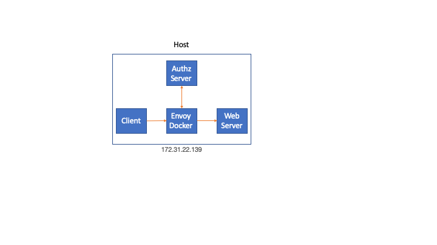

# Tutorial

This example shows Envoy proxy using an external authorization server.

This is example is based on the [rate limit example](https://github.com/jbarratt/envoy_ratelimit_example)

## 1. Network Diagram

In this tutorial everything runs on a single host in order to simplify the deployment.



## 2. Envoy Docker

Build and run Envoy Docker

```
./build_envoy_docker.sh
```

## 3. External Authorization Server

```
go build
./ext-authz-proxy
```

## 4. Simple Web Server

Go to simple-go-server directory

```
go build
./simple-go-server
http: 2020/02/20 15:58:30 Simple go server
http: 2020/02/20 15:58:30 Version: 
http: 2020/02/20 15:58:30 GitTag: 
http: 2020/02/20 15:58:30 GitCommit: 
http: 2020/02/20 15:58:30 GitTreeState: 
http: 2020/02/20 15:58:30 Server is starting...
http: 2020/02/20 15:58:30 Server is ready to handle requests at :5000

```

## 5. Client Request

Issue the HTTP request

```
curl localhost:4999
```

Response from Server on successful authorization

```
ubuntu$ curl -v localhost:4999
* Rebuilt URL to: localhost:4999/
*   Trying ::1...
* TCP_NODELAY set
* Connected to localhost (::1) port 4999 (#0)
> GET / HTTP/1.1
> Host: localhost:4999
> User-Agent: curl/7.54.0
> Accept: */*
>
< HTTP/1.1 200 OK
< content-type: text/plain; charset=utf-8
< x-content-type-options: nosniff
< x-request-id: 2cbd2bad-8298-4e75-af98-c9301b7ba061
< date: Thu, 20 Feb 2020 23:59:00 GMT
< content-length: 14
< x-envoy-upstream-service-time: 2
< server: envoy
<
Hello, World!
* Connection #0 to host localhost left intact
```


## 6. External Server

HTTP Headers received by external authorization server. One or more of these could be used together with other sources of data.

```
ubuntu$ ./ext-authz-proxy
2019/08/19 19:46:59 listening on [::]:5010
Source IP:port 172.17.0.1:58772
{
  "id": "4357586331639866428",
  "method": "GET",
  "headers": {
    ":authority": "localhost:4999",
    ":method": "GET",
    ":path": "/",
    "accept": "*/*",
    "user-agent": "curl/7.54.0",
    "x-envoy-internal": "true",
    "x-forwarded-for": "172.17.0.1",
    "x-forwarded-proto": "http",
    "x-request-id": "2cbd2bad-8298-4e75-af98-c9301b7ba061"
  },
  "path": "/",
  "host": "localhost:4999",
  "protocol": "HTTP/1.1"
}

```

Finally, the external authorization server will inject two headers on the response that should be added to the request by Envoy.

```
X-Ext-Auth-Id                           : curl
X-Ext-Auth-Id-User                      : bob
```


## 7. Web Server

We can see that the two headers that the external server injected were received by the web server.

```
HTTP Headers Received:
======================
User-Agent                              : curl/7.54.0
Accept                                  : */*
X-Forwarded-Proto                       : http
X-Envoy-Internal                        : true
X-Ext-Auth-Id                           : curl
X-Envoy-Expected-Rq-Timeout-Ms          : 15000
X-Request-Downstream-Combo              : 2020/02/20T23:59:00+0000 1582243140
Content-Length                          : 0
X-Forwarded-For                         : 172.17.0.1
X-Request-Id                            : 2cbd2bad-8298-4e75-af98-c9301b7ba061
X-Ext-Auth-Id-User                      : bob

http: 2020/02/20 15:59:00 2cbd2bad-8298-4e75-af98-c9301b7ba061 GET / 127.0.0.1:50131 curl/7.54.0

```

## 7.Authorized Request Envoy Logs

Envoy logs from a request that was authorized

```
[2020-02-20 23:59:00.592][18][debug][conn_handler] [source/server/connection_handler_impl.cc:353] [C6] new connection
[2020-02-20 23:59:00.592][18][debug][http] [source/common/http/conn_manager_impl.cc:263] [C6] new stream
[2020-02-20 23:59:00.592][18][debug][http] [source/common/http/conn_manager_impl.cc:731] [C6][S4357586331639866428] request headers complete (end_stream=true):
':authority', 'localhost:4999'
':path', '/'
':method', 'GET'
'user-agent', 'curl/7.54.0'
'accept', '*/*'

[2020-02-20 23:59:00.592][18][debug][http] [source/common/http/conn_manager_impl.cc:1276] [C6][S4357586331639866428] request end stream
[2020-02-20 23:59:00.593][18][debug][router] [source/common/router/router.cc:474] [C0][S4823854182361172018] cluster 'ext-authz' match for URL '/envoy.service.auth.v2.Authorization/Check'
[2020-02-20 23:59:00.593][18][debug][router] [source/common/router/router.cc:614] [C0][S4823854182361172018] router decoding headers:
':method', 'POST'
':path', '/envoy.service.auth.v2.Authorization/Check'
':authority', 'ext-authz'
':scheme', 'http'
'te', 'trailers'
'grpc-timeout', '200m'
'content-type', 'application/grpc'
'x-envoy-internal', 'true'
'x-forwarded-for', '172.17.0.2'
'x-envoy-expected-rq-timeout-ms', '200'

[2020-02-20 23:59:00.593][18][debug][pool] [source/common/http/http2/conn_pool.cc:97] [C4] creating stream
[2020-02-20 23:59:00.593][18][debug][router] [source/common/router/router.cc:1711] [C0][S4823854182361172018] pool ready
[2020-02-20 23:59:00.594][18][debug][router] [source/common/router/router.cc:1115] [C0][S4823854182361172018] upstream headers complete: end_stream=false
[2020-02-20 23:59:00.594][18][debug][http] [source/common/http/async_client_impl.cc:95] async http request response headers (end_stream=false):
':status', '200'
'content-type', 'application/grpc'
'x-envoy-upstream-service-time', '1'

[2020-02-20 23:59:00.594][18][debug][client] [source/common/http/codec_client.cc:104] [C4] response complete
[2020-02-20 23:59:00.594][18][debug][pool] [source/common/http/http2/conn_pool.cc:232] [C4] destroying stream: 0 remaining
[2020-02-20 23:59:00.594][18][debug][http] [source/common/http/async_client_impl.cc:121] async http request response trailers:
'grpc-status', '0'
'grpc-message', ''

[2020-02-20 23:59:00.594][18][debug][router] [source/common/router/router.cc:474] [C6][S4357586331639866428] cluster 'simple-server' match for URL '/'
[2020-02-20 23:59:00.594][18][debug][router] [source/common/router/router.cc:614] [C6][S4357586331639866428] router decoding headers:
':authority', 'localhost:4999'
':path', '/'
':method', 'GET'
':scheme', 'http'
'user-agent', 'curl/7.54.0'
'accept', '*/*'
'x-forwarded-for', '172.17.0.1'
'x-forwarded-proto', 'http'
'x-envoy-internal', 'true'
'x-request-id', '2cbd2bad-8298-4e75-af98-c9301b7ba061'
'x-ext-auth-id', 'curl'
'x-ext-auth-id-user', 'bob'
'x-envoy-expected-rq-timeout-ms', '15000'
'x-request-downstream-combo', '2020/02/20T23:59:00+0000 1582243140'

[2020-02-20 23:59:00.595][18][debug][pool] [source/common/http/http1/conn_pool.cc:95] creating a new connection
[2020-02-20 23:59:00.595][18][debug][client] [source/common/http/codec_client.cc:34] [C7] connecting
[2020-02-20 23:59:00.595][18][debug][connection] [source/common/network/connection_impl.cc:691] [C7] connecting to 192.168.65.2:5000
[2020-02-20 23:59:00.595][18][debug][connection] [source/common/network/connection_impl.cc:700] [C7] connection in progress
[2020-02-20 23:59:00.595][18][debug][pool] [source/common/http/conn_pool_base.cc:55] queueing request due to no available connections
[2020-02-20 23:59:00.595][18][debug][http2] [source/common/http/http2/codec_impl.cc:732] [C4] stream closed: 0
[2020-02-20 23:59:00.596][18][debug][connection] [source/common/network/connection_impl.cc:563] [C7] connected
[2020-02-20 23:59:00.596][18][debug][client] [source/common/http/codec_client.cc:72] [C7] connected
[2020-02-20 23:59:00.596][18][debug][pool] [source/common/http/http1/conn_pool.cc:244] [C7] attaching to next request
[2020-02-20 23:59:00.596][18][debug][router] [source/common/router/router.cc:1711] [C6][S4357586331639866428] pool ready
[2020-02-20 23:59:00.597][18][debug][router] [source/common/router/router.cc:1115] [C6][S4357586331639866428] upstream headers complete: end_stream=false
[2020-02-20 23:59:00.597][18][debug][http] [source/common/http/conn_manager_impl.cc:1615] [C6][S4357586331639866428] encoding headers via codec (end_stream=false):
':status', '200'
'content-type', 'text/plain; charset=utf-8'
'x-content-type-options', 'nosniff'
'x-request-id', '2cbd2bad-8298-4e75-af98-c9301b7ba061'
'date', 'Thu, 20 Feb 2020 23:59:00 GMT'
'content-length', '14'
'x-envoy-upstream-service-time', '2'
'server', 'envoy'

[2020-02-20 23:59:00.597][18][debug][client] [source/common/http/codec_client.cc:104] [C7] response complete
[2020-02-20 23:59:00.598][18][debug][pool] [source/common/http/http1/conn_pool.cc:201] [C7] response complete
[2020-02-20 23:59:00.598][18][debug][pool] [source/common/http/http1/conn_pool.cc:239] [C7] moving to ready
[2020-02-20 23:59:00.600][18][debug][connection] [source/common/network/connection_impl.cc:531] [C6] remote close
[2020-02-20 23:59:00.600][18][debug][connection] [source/common/network/connection_impl.cc:192] [C6] closing socket: 0
[2020-02-20 23:59:00.600][18][debug][conn_handler] [source/server/connection_handler_impl.cc:86] [C6] adding to cleanup list
[2020-02-20 23:59:03.180][7][debug][main] [source/server/server.cc:174] flushing stats
```


