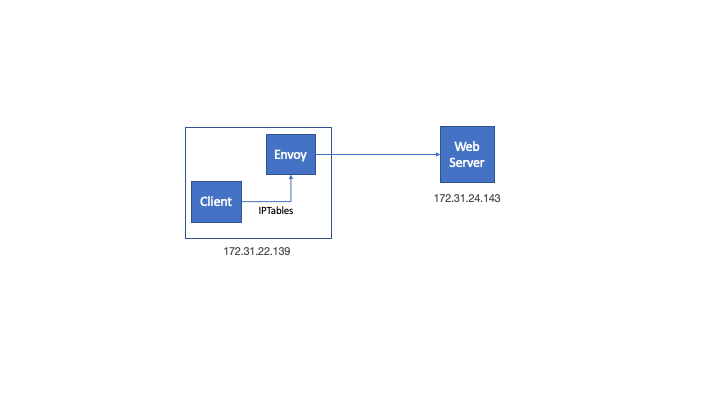

# Tutorial

**This was tested on Ubuntu 18.04**

In this example of we run a [Dynamic Forward Envoy Proxy](https://www.envoyproxy.io/docs/envoy/v1.11.0/configuration/http_filters/dynamic_forward_proxy_filter) that listens on port 4999 and directs requests to their original destination. 

The practical use-case is to confine applications running on the same host as the envoy proxy by using it as a forward proxy. Applications can not communicate directly out due IPTables rules.

## 1. Network Diagram

The HTTP Client (cURL) and Envoy proxy share the same host. cURL runs as a native application and Envoy runs in a docker container

A second host runs the web server



## 2. Envoy Docker

Build and run the envoy container:

```
./build_envoy_docker.sh
```

Make sure you are still able to access the Internet unhindered

```
ubuntu$ curl -v www.cnn.com
* Rebuilt URL to: www.cnn.com/
*   Trying 151.101.189.67...
* TCP_NODELAY set
* Connected to www.cnn.com (151.101.189.67) port 80 (#0)
> GET / HTTP/1.1
> Host: www.cnn.com
> User-Agent: curl/7.58.0
> Accept: */*
>
< HTTP/1.1 301 Moved Permanently
< Server: Varnish
< Retry-After: 0
< Content-Length: 0
< Cache-Control: public, max-age=600
< Location: https://www.cnn.com/
< Accept-Ranges: bytes
< Date: Fri, 09 Aug 2019 15:39:41 GMT
< Via: 1.1 varnish
< Connection: close
< Set-Cookie: countryCode=US; Domain=.cnn.com; Path=/
< Set-Cookie: geoData=san jose|CA|95123|US|NA|-700|broadband; Domain=.cnn.com; Path=/
< X-Served-By: cache-pao17426-PAO
< X-Cache: HIT
< X-Cache-Hits: 0
<
* Closing connection 0
```

## 3. IPTables

Now install the IPtables redirect rules

```
./create_iptables.sh
```

## 4. HTTP Request

Access to websites on ports 80 and 443 should go through the envoy proxy. Noticed the *x-envoy-upstream-service-time: 1* HTTP header

```
ubuntu$ curl -v www.cnn.com
* Rebuilt URL to: www.cnn.com/
*   Trying 151.101.41.67...
* TCP_NODELAY set
* Connected to www.cnn.com (151.101.41.67) port 80 (#0)
> GET / HTTP/1.1
> Host: www.cnn.com
> User-Agent: curl/7.58.0
> Accept: */*
>
< HTTP/1.1 301 Moved Permanently
< server: envoy
< retry-after: 0
< content-length: 0
< cache-control: public, max-age=600
< location: https://www.cnn.com/
< accept-ranges: bytes
< date: Thu, 19 Sep 2019 07:05:55 GMT
< via: 1.1 varnish
< set-cookie: countryCode=US; Domain=.cnn.com; Path=/
< set-cookie: geoData=san jose|CA|95123|US|NA|-700|broadband; Domain=.cnn.com; Path=/
< x-served-by: cache-sjc3147-SJC
< x-cache: HIT
< x-cache-hits: 0
< x-envoy-upstream-service-time: 1
<
* Connection #0 to host www.cnn.com left intact
```

## 5. IPTables Stats

IPTables statistics should show the redirected packets

```
ubuntu$ ./show_iptables.sh
Chain OUTPUT (policy ACCEPT 11 packets, 835 bytes)
 pkts bytes target     prot opt in     out     source               destination
    0     0 DOCKER     all  --  *      *       0.0.0.0/0           !127.0.0.0/8          ADDRTYPE match dst-type LOCAL
    1    60 REDIRECT   tcp  --  *      *       0.0.0.0/0            0.0.0.0/0            tcp dpt:80 ! owner UID match 0 redir ports 4999
    0     0 REDIRECT   tcp  --  *      *       0.0.0.0/0            0.0.0.0/0            tcp dpt:443 ! owner UID match 0 redir ports 8443
```

## 6. Envoy Logs

Envoy Logs for successful run.

```
[2019-09-19 07:05:55.453][14][debug][main] [source/server/connection_handler_impl.cc:280] [C11527] new connection
[2019-09-19 07:05:55.453][14][debug][http] [source/common/http/conn_manager_impl.cc:246] [C11527] new stream
[2019-09-19 07:05:55.453][14][debug][http] [source/common/http/conn_manager_impl.cc:619] [C11527][S8810675841545829999] request headers complete (end_stream=true):
':authority', 'www.cnn.com'
':path', '/'
':method', 'GET'
'user-agent', 'curl/7.58.0'
'accept', '*/*'

[2019-09-19 07:05:55.453][14][debug][http] [source/common/http/conn_manager_impl.cc:1111] [C11527][S8810675841545829999] request end stream
[2019-09-19 07:05:55.453][14][debug][forward_proxy] [source/extensions/common/dynamic_forward_proxy/dns_cache_impl.cc:44] thread local lookup for host 'www.cnn.com'
[2019-09-19 07:05:55.454][14][debug][forward_proxy] [source/extensions/common/dynamic_forward_proxy/dns_cache_impl.cc:58] thread local miss for host 'www.cnn.com', posting to main thread
[2019-09-19 07:05:55.454][14][debug][forward_proxy] [source/extensions/filters/http/dynamic_forward_proxy/proxy_filter.cc:83] [C11527][S8810675841545829999] waiting to load DNS cache entry
[2019-09-19 07:05:55.454][7][debug][forward_proxy] [source/extensions/common/dynamic_forward_proxy/dns_cache_impl.cc:135] starting main thread resolve for host='www.cnn.com' dns='www.cnn.com' port='80'
[2019-09-19 07:05:55.454][7][debug][forward_proxy] [source/extensions/common/dynamic_forward_proxy/dns_cache_impl.cc:148] main thread resolve complete for host 'www.cnn.com'. 1 results
[2019-09-19 07:05:55.454][7][debug][forward_proxy] [source/extensions/common/dynamic_forward_proxy/dns_cache_impl.cc:181] host 'www.cnn.com' address has changed
[2019-09-19 07:05:55.454][7][debug][upstream] [source/extensions/clusters/dynamic_forward_proxy/cluster.cc:84] adding new dfproxy cluster host 'www.cnn.com'
[2019-09-19 07:05:55.454][7][debug][upstream] [source/common/upstream/cluster_manager_impl.cc:999] membership update for TLS cluster dynamic_forward_proxy_cluster added 1 removed 0
[2019-09-19 07:05:55.454][7][debug][upstream] [source/common/upstream/cluster_manager_impl.cc:1006] re-creating local LB for TLS cluster dynamic_forward_proxy_cluster
[2019-09-19 07:05:55.454][13][debug][upstream] [source/common/upstream/cluster_manager_impl.cc:999] membership update for TLS cluster dynamic_forward_proxy_cluster added 1 removed 0
[2019-09-19 07:05:55.454][13][debug][upstream] [source/common/upstream/cluster_manager_impl.cc:1006] re-creating local LB for TLS cluster dynamic_forward_proxy_cluster
[2019-09-19 07:05:55.454][14][debug][upstream] [source/common/upstream/cluster_manager_impl.cc:999] membership update for TLS cluster dynamic_forward_proxy_cluster added 1 removed 0
[2019-09-19 07:05:55.454][14][debug][upstream] [source/common/upstream/cluster_manager_impl.cc:1006] re-creating local LB for TLS cluster dynamic_forward_proxy_cluster
[2019-09-19 07:05:55.454][14][debug][forward_proxy] [source/extensions/filters/http/dynamic_forward_proxy/proxy_filter.cc:100] [C11527][S8810675841545829999] load DNS cache complete, continuing
[2019-09-19 07:05:55.454][14][debug][router] [source/common/router/router.cc:401] [C11527][S8810675841545829999] cluster 'dynamic_forward_proxy_cluster' match for URL '/'
[2019-09-19 07:05:55.454][14][debug][router] [source/common/router/router.cc:514] [C11527][S8810675841545829999] router decoding headers:
':authority', 'www.cnn.com'
':path', '/'
':method', 'GET'
':scheme', 'http'
'user-agent', 'curl/7.58.0'
'accept', '*/*'
'x-forwarded-proto', 'http'
'x-request-id', '489942a5-8bc2-4f7b-b716-5409733f081e'
'x-envoy-expected-rq-timeout-ms', '15000'

[2019-09-19 07:05:55.454][14][debug][pool] [source/common/http/http1/conn_pool.cc:88] creating a new connection
[2019-09-19 07:05:55.454][14][debug][client] [source/common/http/codec_client.cc:26] [C11528] connecting
[2019-09-19 07:05:55.454][14][debug][connection] [source/common/network/connection_impl.cc:704] [C11528] connecting to 151.101.41.67:80
[2019-09-19 07:05:55.454][14][debug][connection] [source/common/network/connection_impl.cc:713] [C11528] connection in progress
[2019-09-19 07:05:55.454][14][debug][pool] [source/common/http/conn_pool_base.cc:20] queueing request due to no available connections
[2019-09-19 07:05:55.455][14][debug][connection] [source/common/network/connection_impl.cc:552] [C11528] connected
[2019-09-19 07:05:55.455][14][debug][client] [source/common/http/codec_client.cc:64] [C11528] connected
[2019-09-19 07:05:55.455][14][debug][pool] [source/common/http/http1/conn_pool.cc:241] [C11528] attaching to next request
[2019-09-19 07:05:55.455][14][debug][router] [source/common/router/router.cc:1503] [C11527][S8810675841545829999] pool ready
[2019-09-19 07:05:55.456][14][debug][client] [source/common/http/codec_client.cc:95] [C11528] response complete
[2019-09-19 07:05:55.456][14][debug][router] [source/common/router/router.cc:994] [C11527][S8810675841545829999] upstream headers complete: end_stream=true
[2019-09-19 07:05:55.456][14][debug][http] [source/common/http/conn_manager_impl.cc:1378] [C11527][S8810675841545829999] encoding headers via codec (end_stream=true):
':status', '301'
'server', 'envoy'
'retry-after', '0'
'content-length', '0'
'cache-control', 'public, max-age=600'
'location', 'https://www.cnn.com/'
'accept-ranges', 'bytes'
'date', 'Thu, 19 Sep 2019 07:05:55 GMT'
'via', '1.1 varnish'
'set-cookie', 'countryCode=US; Domain=.cnn.com; Path=/'
'set-cookie', 'geoData=san jose|CA|95123|US|NA|-700|broadband; Domain=.cnn.com; Path=/'
'x-served-by', 'cache-sjc3147-SJC'
'x-cache', 'HIT'
'x-cache-hits', '0'
'x-envoy-upstream-service-time', '1'

[2019-09-19 07:05:55.456][14][debug][pool] [source/common/http/http1/conn_pool.cc:198] [C11528] response complete
[2019-09-19 07:05:55.456][14][debug][pool] [source/common/http/http1/conn_pool.cc:203] [C11528] saw upstream close connection
[2019-09-19 07:05:55.456][14][debug][connection] [source/common/network/connection_impl.cc:101] [C11528] closing data_to_write=0 type=1
[2019-09-19 07:05:55.456][14][debug][connection] [source/common/network/connection_impl.cc:190] [C11528] closing socket: 1
[2019-09-19 07:05:55.456][14][debug][client] [source/common/http/codec_client.cc:82] [C11528] disconnect. resetting 0 pending requests
[2019-09-19 07:05:55.456][14][debug][pool] [source/common/http/http1/conn_pool.cc:129] [C11528] client disconnected, failure reason:
[2019-09-19 07:05:55.457][14][debug][connection] [source/common/network/connection_impl.cc:520] [C11527] remote close
[2019-09-19 07:05:55.457][14][debug][connection] [source/common/network/connection_impl.cc:190] [C11527] closing socket: 0
[2019-09-19 07:05:55.458][14][debug][main] [source/server/connection_handler_impl.cc:80] [C11527] adding to cleanup list
[2019-09-19 07:05:57.943][7][debug][main] [source/server/server.cc:170] flushing stats
[2019-09-19 07:06:02.948][7][debug][main] [source/server/server.cc:170] flushing stats
[2019-09-19 07:06:07.951][7][debug][main] [source/server/server.cc:170] flushing stats
[2019-09-19 07:06:12.956][7][debug][main] [source/server/server.cc:170] flushing stats
[2019-09-19 07:06:17.960][7][debug][main] [source/server/server.cc:170] flushing stats
[2019-09-19 07:06:22.963][7][debug][main] [source/server/server.cc:170] flushing stats
[2019-09-19 07:06:27.967][7][debug][main] [source/server/server.cc:170] flushing stats
[2019-09-19 07:06:32.972][7][debug][main] [source/server/server.cc:170] flushing stats
[2019-09-19 07:06:37.976][7][debug][main] [source/server/server.cc:170] flushing stats
[2019-09-19 07:06:42.980][7][debug][main] [source/server/server.cc:170] flushing stats
[2019-09-19 07:06:47.983][7][debug][main] [source/server/server.cc:170] flushing stats
[2019-09-19 07:06:52.985][7][debug][main] [source/server/server.cc:170] flushing stats
[2019-09-19 07:06:55.455][7][debug][forward_proxy] [source/extensions/common/dynamic_forward_proxy/dns_cache_impl.cc:122] host='www.cnn.com' TTL check: now=2971227504066604 last_used=2971167503335194
[2019-09-19 07:06:55.455][7][debug][forward_proxy] [source/extensions/common/dynamic_forward_proxy/dns_cache_impl.cc:135] starting main thread resolve for host='www.cnn.com' dns='www.cnn.com' port='80'
[2019-09-19 07:06:55.458][7][debug][forward_proxy] [source/extensions/common/dynamic_forward_proxy/dns_cache_impl.cc:148] main thread resolve complete for host 'www.cnn.com'. 1 results
[2019-09-19 07:06:55.458][7][debug][forward_proxy] [source/extensions/common/dynamic_forward_proxy/dns_cache_impl.cc:181] host 'www.cnn.com' address has changed
[2019-09-19 07:06:55.458][7][debug][upstream] [source/extensions/clusters/dynamic_forward_proxy/cluster.cc:79] updating dfproxy cluster host address 'www.cnn.com'
[2019-09-19 07:06:57.989][7][debug][main] [source/server/server.cc:170] flushing stats
[2019-09-19 07:07:02.995][7][debug][main] [source/server/server.cc:170] flushing stats
[2019-09-19 07:07:07.996][7][debug][main] [source/server/server.cc:170] flushing stats
[2019-09-19 07:07:13.004][7][debug][main] [source/server/server.cc:170] flushing stats
ubuntu@ip-172-31-24-143
```

## 7. Cleaning

```
./clean_envoy_docker.sh
./clean_iptables.sh
```


