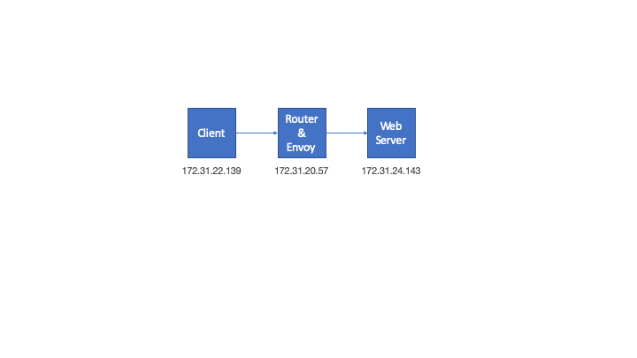
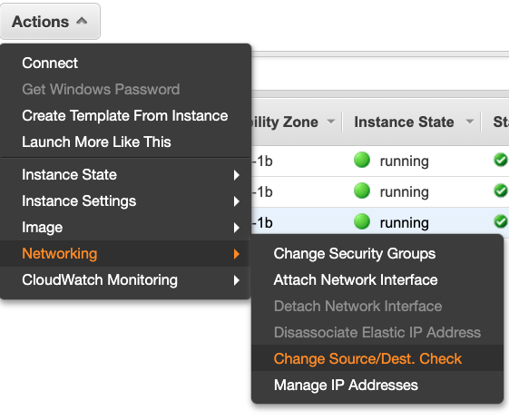

# Tutorial

This tutorial shows how to use Envoy in [Transparent Proxy](https://www.envoyproxy.io/docs/envoy/latest/api-v2/api/v2/lds.proto#envoy-api-field-listener-transparent) mode. The distinguishing feature in this scenario is that there is no NAT.

Transparent Proxy or TPROXY is a Linux Kernel feature without a lot of documentation. The common referenced documentation is the [original feature write-up](https://www.kernel.org/doc/Documentation/networking/tproxy.txt)

This was tested on **AWS** Ubuntu 18.04

## Pre-requisites

Install Docker

```bash
sudo apt-get update
sudo apt install docker.io
sudo systemctl enable docker
sudo groupadd docker
sudo usermod -aG docker ${USER}
```

Logout and login

```bash
ubuntu$ docker run hello-world
Unable to find image 'hello-world:latest' locally
latest: Pulling from library/hello-world
1b930d010525: Pull complete
Digest: sha256:fc6a51919cfeb2e6763f62b6d9e8815acbf7cd2e476ea353743570610737b752
Status: Downloaded newer image for hello-world:latest

Hello from Docker!
```


## 1. Network Diagram

 



## 2. Router Host

The router host performs the following functions:

* Forwards packets between client and server
* Runs Envoy Proxy
* Transparently redirect packets to Envoy Proxy


### 2.1 Forwarding

Enable forwarding on the host. There are many good tutorials on the web on how to enable forwarding on a Linux host. 

### 2.2 Envoy Docker

Build and run Envoy Docker **before** you install TPROXY and add IPTable routes or docker build will fail because it will not be able to access the Internet.

```
./build_envoy_docker_net_admin.sh
```

Envoy docker needs to run with **--network host** and **--cap-add=NET_ADMIN** because it needs access to the original destination IP:port of the packet. This is done by using the socket option **SO_ORIGINAL_DST**. Check Envoy's specific documentation on [original destination filter](https://www.envoyproxy.io/docs/envoy/latest/configuration/listener_filters/original_dst_filter)

Finally, the Envoy container **must** be run under root in order for the IPTables redirection to work properly as we will see later. You should see an output similar to this one.

```bash
ubuntu$ docker ps -a
CONTAINER ID        IMAGE               COMMAND                  CREATED              STATUS                      PORTS               NAMES
af3e581a9a7a        envoy-tproxy        "/bin/sh -c ./start_…"   About a minute ago   Up About a minute                               envoy-tproxy
4957e43ca9c0        hello-world         "/hello"                 11 minutes ago       Exited (0) 11 minutes ago                       boring_panini
ubuntu$ ps aux | grep envoy
root      6579  0.3  0.0   4504   748 ?        Ss   19:48   0:00 /bin/sh -c ./start_envoy.sh
root      6603  0.0  0.0   4504   700 ?        S    19:48   0:00 /bin/sh ./start_envoy.sh
root      6604  0.1  3.3 119944 33812 ?        Sl   19:48   0:00 envoy -c /etc/service-envoy.yaml --log-level debug
ubuntu    6638  0.0  0.0  14660  1004 pts/0    S+   19:49   0:00 grep --color=auto envoy
```


#### 2.2.1 Socket Option SO_ORIGINAL_DST

A small [python script](./original_destination.py) is included to demonstrate how proxies get the original IP:port from redirected connections. Assuming the IPTables rule below is in place, start this script as root instead of Envoy to get a deeper understanding of this socket option.

### 2.3 TPROXY

Installing TPROXY kernel module is tricky and there are many unanswered question from people on the net. If it *just works* when you try consider yourself lucky. Again, this tutorial was tested on AWS Ubuntu 18.04

I created this simple step-by-step script to help install TPROXY. If you get errors  just open the file ans execute each command in order.

```bash
./tproxy_install.sh
```

You should see an output similar to this one:

```bash
ubuntu$ ./tproxy_install.sh
CONFIG_NETFILTER_XT_TARGET_TPROXY=m
xt_TPROXY.ko
insmod /lib/modules/4.15.0-1057-aws/kernel/net/ipv6/netfilter/nf_defrag_ipv6.ko
insmod /lib/modules/4.15.0-1057-aws/kernel/net/netfilter/xt_TPROXY.ko
insmod /lib/modules/4.15.0-1057-aws/kernel/net/ipv6/netfilter/nf_defrag_ipv6.ko
insmod /lib/modules/4.15.0-1057-aws/kernel/net/netfilter/xt_TPROXY.ko
xt_TPROXY              20480  0
nf_defrag_ipv6         20480  1 xt_TPROXY
nf_defrag_ipv4         16384  2 nf_conntrack_ipv4,xt_TPROXY
x_tables               40960  6 xt_conntrack,iptable_filter,ipt_MASQUERADE,xt_addrtype,xt_TPROXY,ip_tables
IPTables Socket option is present
IPTables TPROXY option is present
```

### 2.4 IPTables, Route and Rule

In order for transparent proxy to work a set of IPTables rules, routes and rules need to be created. 

```bash
./create_ip_tables.sh
```

You should see an output similar to this one:

```bash
Chain PREROUTING (policy ACCEPT)
target     prot opt source               destination
DIVERT     tcp  --  anywhere             anywhere             socket

Chain INPUT (policy ACCEPT)
target     prot opt source               destination

Chain FORWARD (policy ACCEPT)
target     prot opt source               destination

Chain OUTPUT (policy ACCEPT)
target     prot opt source               destination

Chain POSTROUTING (policy ACCEPT)
target     prot opt source               destination

Chain DIVERT (1 references)
target     prot opt source               destination
MARK       all  --  anywhere             anywhere             MARK set 0x1
ACCEPT     all  --  anywhere             anywhere
local default dev lo scope host
0:	from all lookup local
32765:	from all fwmark 0x1 lookup 100
32766:	from all lookup main
32767:	from all lookup default

```

### 2.5 Disable IP source and Destination Check

If you are running this example in AWS you need to disable IP source and destination check so the host can accept packet not directed to its interface.




## 3. Web Server

The Web Server for this example was running on *172.31.1.180*

I normally use [httpbin](http://httpbin.org/) as the Web Server. A reliable, no-hassle, perfect-for-testing web server.

```
./run_web_docker.sh
```

## 4. Client Host

### 4.1 Route

Add a route to the web server through the Envoy/Router host.

```bash
sudo ip route add 172.31.1.180/32 via 172.31.13.100 dev eth0
```

Check if route is present

```
ubuntu$ sudo ip route show

...snip...

172.31.1.180 via 172.31.13.100 dev eth0
```

### 4.2 HTTP Request

Use cURL or your preferred HTTP client to perform a request to the web server. 

```
ubuntu$ curl -v 172.31.1.180
* Rebuilt URL to: 172.31.1.180/
*   Trying 172.31.1.180...
* TCP_NODELAY set
* Connected to 172.31.1.180 (172.31.1.180) port 80 (#0)
> GET / HTTP/1.1
> Host: 172.31.1.180
> User-Agent: curl/7.58.0
> Accept: */*
>
< HTTP/1.1 200 OK
< server: envoy
< date: Sat, 29 Feb 2020 03:03:50 GMT
< content-type: text/html; charset=utf-8
< content-length: 9593
< access-control-allow-origin: *
< access-control-allow-credentials: true
< x-envoy-upstream-service-time: 2
<
<!DOCTYPE html>
<html lang="en">
```
## 5. Envoy Logs

Envoy Logs for successful run.

```
[2020-02-29 03:03:51.185][13][debug][filter] [source/extensions/filters/listener/original_dst/original_dst.cc:18] original_dst: New connection accepted
[2020-02-29 03:03:51.185][13][debug][conn_handler] [source/server/connection_handler_impl.cc:353] [C0] new connection
[2020-02-29 03:03:51.185][13][debug][http] [source/common/http/conn_manager_impl.cc:263] [C0] new stream
[2020-02-29 03:03:51.193][13][debug][http] [source/common/http/conn_manager_impl.cc:731] [C0][S3259578723723410620] request headers complete (end_stream=true):
':authority', '172.31.1.180'
':path', '/'
':method', 'GET'
'user-agent', 'curl/7.58.0'
'accept', '*/*'

[2020-02-29 03:03:51.193][13][debug][http] [source/common/http/conn_manager_impl.cc:1276] [C0][S3259578723723410620] request end stream
[2020-02-29 03:03:51.193][13][debug][router] [source/common/router/router.cc:474] [C0][S3259578723723410620] cluster 'cluster1' match for URL '/'
[2020-02-29 03:03:51.193][13][debug][upstream] [source/common/upstream/upstream_impl.cc:262] transport socket match, socket default selected for host with address 172.31.1.180:80
[2020-02-29 03:03:51.193][13][debug][upstream] [source/common/upstream/original_dst_cluster.cc:62] Created host 172.31.1.180:80.
[2020-02-29 03:03:51.193][13][debug][router] [source/common/router/router.cc:614] [C0][S3259578723723410620] router decoding headers:
':authority', '172.31.1.180'
':path', '/'
':method', 'GET'
':scheme', 'http'
'user-agent', 'curl/7.58.0'
'accept', '*/*'
'x-forwarded-proto', 'http'
'x-request-id', 'd665c434-8af0-4c27-9739-53cdfc93dc02'
'x-envoy-expected-rq-timeout-ms', '15000'

[2020-02-29 03:03:51.194][13][debug][pool] [source/common/http/http1/conn_pool.cc:95] creating a new connection
[2020-02-29 03:03:51.194][13][debug][client] [source/common/http/codec_client.cc:34] [C1] connecting
[2020-02-29 03:03:51.194][13][debug][connection] [source/common/network/connection_impl.cc:691] [C1] connecting to 172.31.1.180:80
[2020-02-29 03:03:51.194][13][debug][connection] [source/common/network/connection_impl.cc:700] [C1] connection in progress
[2020-02-29 03:03:51.194][13][debug][pool] [source/common/http/conn_pool_base.cc:55] queueing request due to no available connections
[2020-02-29 03:03:51.194][7][debug][upstream] [source/common/upstream/original_dst_cluster.cc:130] addHost() adding 172.31.1.180:80
[2020-02-29 03:03:51.194][7][debug][upstream] [source/common/upstream/cluster_manager_impl.cc:1084] membership update for TLS cluster cluster1 added 1 removed 0
[2020-02-29 03:03:51.194][7][debug][upstream] [source/common/upstream/cluster_manager_impl.cc:1091] re-creating local LB for TLS cluster cluster1
[2020-02-29 03:03:51.194][13][debug][upstream] [source/common/upstream/cluster_manager_impl.cc:1084] membership update for TLS cluster cluster1 added 1 removed 0
[2020-02-29 03:03:51.194][13][debug][upstream] [source/common/upstream/cluster_manager_impl.cc:1091] re-creating local LB for TLS cluster cluster1
[2020-02-29 03:03:51.194][13][debug][connection] [source/common/network/connection_impl.cc:563] [C1] connected
[2020-02-29 03:03:51.195][13][debug][client] [source/common/http/codec_client.cc:72] [C1] connected
[2020-02-29 03:03:51.195][13][debug][pool] [source/common/http/http1/conn_pool.cc:244] [C1] attaching to next request
[2020-02-29 03:03:51.195][13][debug][router] [source/common/router/router.cc:1711] [C0][S3259578723723410620] pool ready
[2020-02-29 03:03:51.197][13][debug][router] [source/common/router/router.cc:1115] [C0][S3259578723723410620] upstream headers complete: end_stream=false
[2020-02-29 03:03:51.197][13][debug][http] [source/common/http/conn_manager_impl.cc:1615] [C0][S3259578723723410620] encoding headers via codec (end_stream=false):
':status', '200'
'server', 'envoy'
'date', 'Sat, 29 Feb 2020 03:03:50 GMT'
'content-type', 'text/html; charset=utf-8'
'content-length', '9593'
'access-control-allow-origin', '*'
'access-control-allow-credentials', 'true'
'x-envoy-upstream-service-time', '2'

[2020-02-29 03:03:51.197][13][debug][client] [source/common/http/codec_client.cc:104] [C1] response complete
[2020-02-29 03:03:51.197][13][debug][pool] [source/common/http/http1/conn_pool.cc:201] [C1] response complete
[2020-02-29 03:03:51.197][13][debug][pool] [source/common/http/http1/conn_pool.cc:239] [C1] moving to ready
[2020-02-29 03:03:51.202][13][debug][connection] [source/common/network/connection_impl.cc:531] [C0] remote close
[2020-02-29 03:03:51.202][13][debug][connection] [source/common/network/connection_impl.cc:192] [C0] closing socket: 0
[2020-02-29 03:03:51.202][13][debug][conn_handler] [source/server/connection_handler_impl.cc:86] [C0] adding to cleanup list
[2020-02-29 03:03:53.072][7][debug][main] [source/server/server.cc:174] flushing stats
[2020-02-29 03:03:53.199][13][debug][connection] [source/common/network/connection_impl.cc:531] [C1] remote close
[2020-02-29 03:03:53.199][13][debug][connection] [source/common/network/connection_impl.cc:192] [C1] closing socket: 0
[2020-02-29 03:03:53.199][13][debug][client] [source/common/http/codec_client.cc:91] [C1] disconnect. resetting 0 pending requests
[2020-02-29 03:03:53.199][13][debug][pool] [source/common/http/http1/conn_pool.cc:136] [C1] client disconnected, failure reason:
[2020-02-29 03:03:58.070][7][debug][main] [source/server/server.cc:174] flushing stats
[2020-02-29 03:03:58.070][13][debug][upstream] [source/common/upstream/cluster_manager_impl.cc:1084] membership update for TLS cluster cluster1 added 0 removed 1
[2020-02-29 03:03:58.070][13][debug][upstream] [source/common/upstream/cluster_manager_impl.cc:1091] re-creating local LB for TLS cluster cluster1
[2020-02-29 03:03:58.070][7][debug][upstream] [source/common/upstream/cluster_manager_impl.cc:1084] membership update for TLS cluster cluster1 added 0 removed 1
[2020-02-29 03:03:58.070][7][debug][upstream] [source/common/upstream/cluster_manager_impl.cc:1091] re-creating local LB for TLS cluster cluster1
[2020-02-29 03:03:58.070][13][debug][upstream] [source/common/upstream/cluster_manager_impl.cc:1067] removing hosts for TLS cluster cluster1 removed 1
[2020-02-29 03:03:58.070][7][debug][upstream] [source/common/upstream/cluster_manager_impl.cc:1067] removing hosts for TLS cluster cluster1 removed 1
[2020-02-29 03:04:03.072][7][debug][main] [source/server/server.cc:174] flushing stats
```

## 6. Cleaning

### 6.1 Router

```
./clean_envoy_docker.sh
./clean_iptables.sh
```

### 6.2 Web Server

```
./clean_web_docker.sh
```
