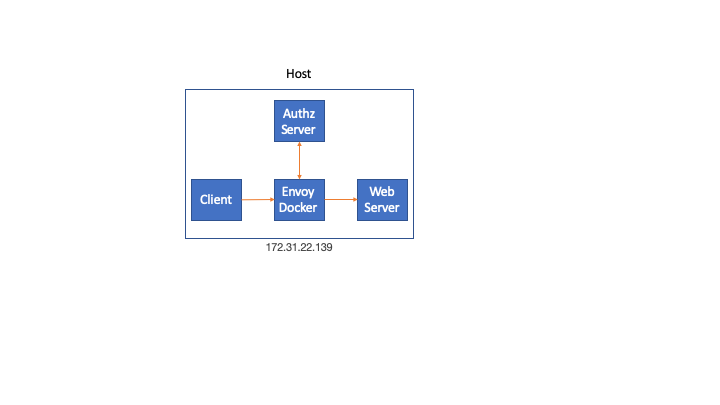

# Tutorial

This example demonstrates how to use Envoy Proxy and Authz server to create a soft boundary around an application in order to create or provide **workload identity** within an AWS EC2 deployment.


## 1. Network Diagram

In this tutorial everything runs on a single host in order to simplify the deployment.



## 2. Envoy Docker

Build and run Envoy Docker

```
./build_envoy_docker.sh
```

## 3. External Authorization Server

```
go build
./workload-identity
```

## 4. Simple Web Server

Go to simple-go-server directory

```
go build
./simple-go-server
```

## 5. Client Request

Issue the HTTP request

```
curl -v localhost:4999
```

Response from Server on successful authorization

```
ubuntu$ curl -v localhost:4999
* Rebuilt URL to: localhost:4999/
*   Trying 127.0.0.1...
* TCP_NODELAY set
* Connected to localhost (127.0.0.1) port 4999 (#0)
> GET / HTTP/1.1
> Host: localhost:4999
> User-Agent: curl/7.58.0
> Accept: */*
>
< HTTP/1.1 200 OK
< content-type: text/plain; charset=utf-8
< x-content-type-options: nosniff
< x-request-id: 772d5638-1ba5-4b83-a5a9-5c3b9e6132ae
< date: Mon, 09 Sep 2019 17:48:17 GMT
< content-length: 14
< x-envoy-upstream-service-time: 0
< server: envoy
<
Hello, World!
* Connection #0 to host localhost left intact
```


## 6. WorkLoad Identity

The external server identifies the application through its source port. In this case *curl* with path */usr/bin* 

```
ubuntu$ ./workload-identity
2019/09/09 17:35:40 listening on [::]:5010
Source IP:port 127.0.0.1:51276
Process name: Curl
Process Exe: /usr/bin/curl
Process User: ubuntu
Process State: ESTABLISHED
{
  "id": "840746502713701496",
  "method": "GET",
  "headers": {
    ":authority": "localhost:4999",
    ":method": "GET",
    ":path": "/",
    "accept": "*/*",
    "user-agent": "curl/7.58.0",
    "x-envoy-internal": "true",
    "x-forwarded-for": "172.31.24.143",
    "x-forwarded-proto": "http",
    "x-request-id": "dc5e7e65-720b-46a1-90e7-0fa17e10d71e"
  },
  "path": "/",
  "host": "localhost:4999",
  "protocol": "HTTP/1.1"
}
```

Finally, the external authorization server will inject two headers on the response that should be added to the request by Envoy.

```
X-Workload-Id                           : Curl
X-Workload-User                         : ubuntu
```

## 7. Web Server

We can see that the two headers that the external server injected were received by the web server.

```
HTTP Headers Received:
======================
Accept                                  : */*
X-Forwarded-For                         : 172.31.24.143
X-Forwarded-Proto                       : http
X-Envoy-Internal                        : true
X-Envoy-Expected-Rq-Timeout-Ms          : 15000
Content-Length                          : 0
X-Request-Id                            : dc5e7e65-720b-46a1-90e7-0fa17e10d71e
X-Workload-Id                           : Curl
X-Workload-User                         : ubuntu
User-Agent                              : curl/7.58.0

http: 2019/09/09 17:55:21 dc5e7e65-720b-46a1-90e7-0fa17e10d71e GET / [::1]:59484 curl/7.58.0

```

## 7.Authorized Request Envoy Logs

Envoy logs from a request that was authorized

```
[2019-09-09 17:35:45.998][14][debug][main] [source/server/connection_handler_impl.cc:280] [C2] new connection
[2019-09-09 17:35:45.998][14][debug][http] [source/common/http/conn_manager_impl.cc:246] [C2] new stream
[2019-09-09 17:35:45.998][14][debug][http] [source/common/http/conn_manager_impl.cc:619] [C2][S8573178212158092554] request headers complete (end_stream=true):
':authority', 'localhost:4999'
':path', '/'
':method', 'GET'
'user-agent', 'curl/7.58.0'
'accept', '*/*'

[2019-09-09 17:35:45.998][14][debug][http] [source/common/http/conn_manager_impl.cc:1111] [C2][S8573178212158092554] request end stream
[2019-09-09 17:35:45.998][14][debug][router] [source/common/router/router.cc:401] [C0][S18116284449863842796] cluster 'ext-authz' match for URL '/envoy.service.auth.v2.Authorization/Check'
[2019-09-09 17:35:45.998][14][debug][router] [source/common/router/router.cc:514] [C0][S18116284449863842796] router decoding headers:
':method', 'POST'
':path', '/envoy.service.auth.v2.Authorization/Check'
':authority', 'ext-authz'
':scheme', 'http'
'te', 'trailers'
'grpc-timeout', '200m'
'content-type', 'application/grpc'
'x-envoy-internal', 'true'
'x-forwarded-for', '172.31.24.143'
'x-envoy-expected-rq-timeout-ms', '200'

[2019-09-09 17:35:45.998][14][debug][client] [source/common/http/codec_client.cc:26] [C3] connecting
[2019-09-09 17:35:45.998][14][debug][connection] [source/common/network/connection_impl.cc:704] [C3] connecting to [::1]:5010
[2019-09-09 17:35:45.998][14][debug][connection] [source/common/network/connection_impl.cc:713] [C3] connection in progress
[2019-09-09 17:35:45.999][14][debug][http2] [source/common/http/http2/codec_impl.cc:899] [C3] setting stream-level initial window size to 268435456
[2019-09-09 17:35:45.999][14][debug][http2] [source/common/http/http2/codec_impl.cc:921] [C3] updating connection-level initial window size to 268435456
[2019-09-09 17:35:45.999][14][debug][pool] [source/common/http/conn_pool_base.cc:20] queueing request due to no available connections
[2019-09-09 17:35:45.999][14][debug][connection] [source/common/network/connection_impl.cc:552] [C3] connected
[2019-09-09 17:35:45.999][14][debug][client] [source/common/http/codec_client.cc:64] [C3] connected
[2019-09-09 17:35:45.999][14][debug][pool] [source/common/http/http2/conn_pool.cc:96] [C3] creating stream
[2019-09-09 17:35:45.999][14][debug][router] [source/common/router/router.cc:1503] [C0][S18116284449863842796] pool ready
[2019-09-09 17:35:46.037][14][debug][router] [source/common/router/router.cc:994] [C0][S18116284449863842796] upstream headers complete: end_stream=false
[2019-09-09 17:35:46.037][14][debug][http] [source/common/http/async_client_impl.cc:91] async http request response headers (end_stream=false):
':status', '200'
'content-type', 'application/grpc'
'x-envoy-upstream-service-time', '38'

[2019-09-09 17:35:46.037][14][debug][client] [source/common/http/codec_client.cc:95] [C3] response complete
[2019-09-09 17:35:46.037][14][debug][pool] [source/common/http/http2/conn_pool.cc:233] [C3] destroying stream: 0 remaining
[2019-09-09 17:35:46.037][14][debug][http] [source/common/http/async_client_impl.cc:106] async http request response trailers:
'grpc-status', '0'
'grpc-message', ''

[2019-09-09 17:35:46.037][14][debug][router] [source/common/router/router.cc:401] [C2][S8573178212158092554] cluster 'simple-server' match for URL '/'
[2019-09-09 17:35:46.037][14][debug][router] [source/common/router/router.cc:514] [C2][S8573178212158092554] router decoding headers:
':authority', 'localhost:4999'
':path', '/'
':method', 'GET'
':scheme', 'http'
'user-agent', 'curl/7.58.0'
'accept', '*/*'
'x-forwarded-for', '172.31.24.143'
'x-forwarded-proto', 'http'
'x-envoy-internal', 'true'
'x-request-id', 'dc0f9eb0-7c5d-49bc-b05f-46ee9cb9a48d'
'x-ext-auth-id', 'curl'
'x-ext-auth-id-user', 'bob'
'x-envoy-expected-rq-timeout-ms', '15000'

[2019-09-09 17:35:46.037][14][debug][pool] [source/common/http/http1/conn_pool.cc:88] creating a new connection
[2019-09-09 17:35:46.037][14][debug][client] [source/common/http/codec_client.cc:26] [C4] connecting
[2019-09-09 17:35:46.037][14][debug][connection] [source/common/network/connection_impl.cc:704] [C4] connecting to [::1]:5000
[2019-09-09 17:35:46.037][14][debug][connection] [source/common/network/connection_impl.cc:713] [C4] connection in progress
[2019-09-09 17:35:46.037][14][debug][pool] [source/common/http/conn_pool_base.cc:20] queueing request due to no available connections
[2019-09-09 17:35:46.037][14][debug][http2] [source/common/http/http2/codec_impl.cc:732] [C3] stream closed: 0
[2019-09-09 17:35:46.037][14][debug][connection] [source/common/network/connection_impl.cc:552] [C4] connected
[2019-09-09 17:35:46.037][14][debug][client] [source/common/http/codec_client.cc:64] [C4] connected
[2019-09-09 17:35:46.037][14][debug][pool] [source/common/http/http1/conn_pool.cc:241] [C4] attaching to next request
[2019-09-09 17:35:46.037][14][debug][router] [source/common/router/router.cc:1503] [C2][S8573178212158092554] pool ready
[2019-09-09 17:35:46.038][14][debug][router] [source/common/router/router.cc:994] [C2][S8573178212158092554] upstream headers complete: end_stream=false
[2019-09-09 17:35:46.038][14][debug][http] [source/common/http/conn_manager_impl.cc:1378] [C2][S8573178212158092554] encoding headers via codec (end_stream=false):
':status', '200'
'content-type', 'text/plain; charset=utf-8'
'x-content-type-options', 'nosniff'
'x-request-id', 'dc0f9eb0-7c5d-49bc-b05f-46ee9cb9a48d'
'date', 'Mon, 09 Sep 2019 17:35:45 GMT'
'content-length', '14'
'x-envoy-upstream-service-time', '0'
'server', 'envoy'

[2019-09-09 17:35:46.038][14][debug][client] [source/common/http/codec_client.cc:95] [C4] response complete
[2019-09-09 17:35:46.038][14][debug][pool] [source/common/http/http1/conn_pool.cc:198] [C4] response complete
[2019-09-09 17:35:46.038][14][debug][pool] [source/common/http/http1/conn_pool.cc:236] [C4] moving to ready
[2019-09-09 17:35:46.038][14][debug][connection] [source/common/network/connection_impl.cc:520] [C2] remote close
[2019-09-09 17:35:46.038][14][debug][connection] [source/common/network/connection_impl.cc:190] [C2] closing socket: 0
[2019-09-09 17:35:46.038][14][debug][main] [source/server/connection_handler_impl.cc:80] [C2] adding to cleanup list
[2019-09-09 17:35:47.626][8][debug][main] [source/server/server.cc:170] flushing stats
[2019-09-09 17:35:52.627][8][debug][main] [source/server/server.cc:170] flushing stats
[2019-09-09 17:35:57.632][8][debug][main] [source/server/server.cc:170] flushing stats
[2019-09-09 17:36:01.040][14][debug][connection] [source/common/network/connection_impl.cc:520] [C4] remote close
[2019-09-09 17:36:01.040][14][debug][connection] [source/common/network/connection_impl.cc:190] [C4] closing socket: 0
[2019-09-09 17:36:01.040][14][debug][client] [source/common/http/codec_client.cc:82] [C4] disconnect. resetting 0 pending requests
[2019-09-09 17:36:01.040][14][debug][pool] [source/common/http/http1/conn_pool.cc:129] [C4] client disconnected, failure reason:
[2019-09-09 17:36:02.635][8][debug][main] [source/server/server.cc:170] flushing stats
```


